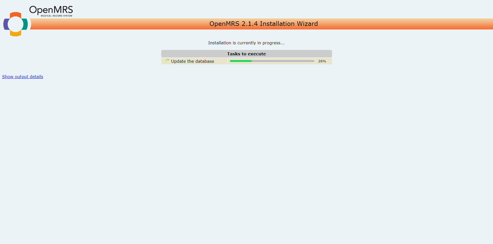
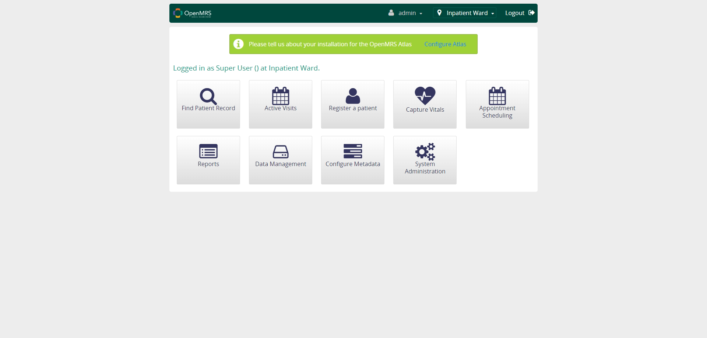
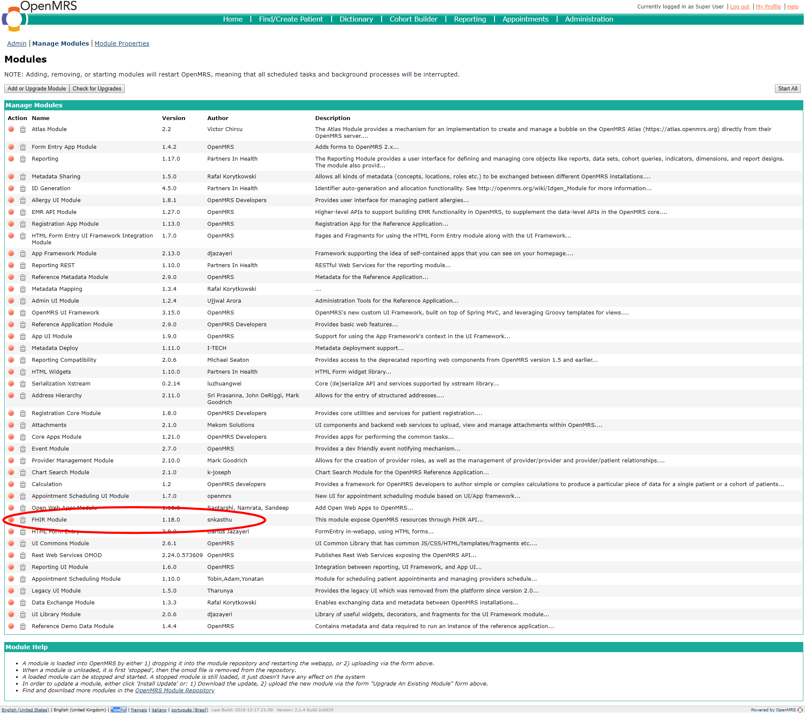
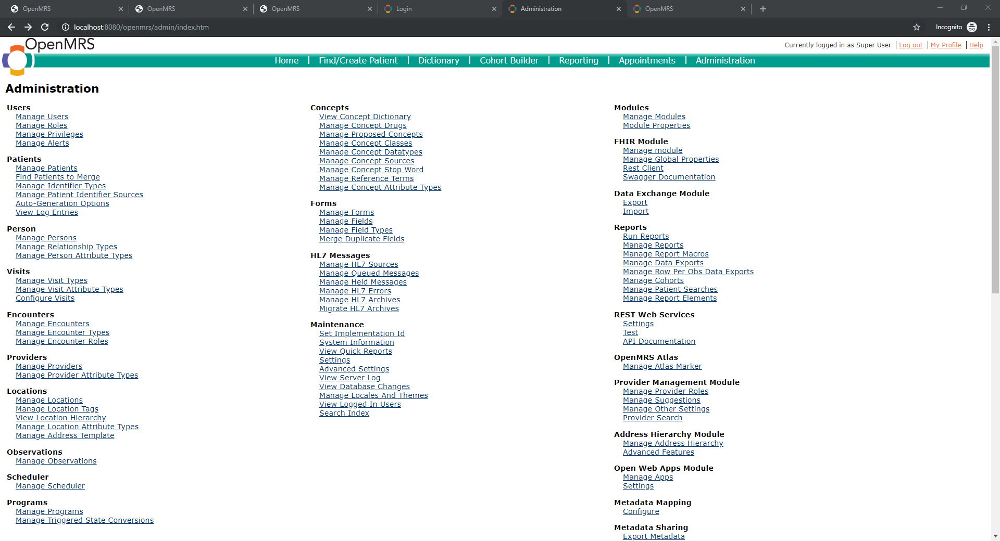

*Check out the [Webinars Github Page](https://github.com/uw-fhir/OpenMRS-FHIR-Webinars/) for another view of these tutorial*\

# Webinar 3 - OpenMRS Dev Setup for FHIR Module and Microfrontends

Video Tutorial: (coming soon)


## Outline
- [Webinar 3 - OpenMRS Dev Setup for FHIR Module and Microfrontends](#webinar-3---openmrs-dev-setup-for-fhir-module-and-microfrontends)
  - [Outline](#outline)
  - [Overview](#overview)
  - [Learning Objectives](#learning-objectives)
  - [Referenced Resources](#referenced-resources)
  - [- https://talk.openmrs.org/t/micro-frontends-architecture-for-openmrs/22557](#httpstalkopenmrsorgtmicro-frontends-architecture-for-openmrs22557)
  - [OpenMRS Architecture Overview](#openmrs-architecture-overview)
  - [OpenMRS FHIR Module Technical Review](#openmrs-fhir-module-technical-review)
      - [SPA Module](#spa-module)
  - [Microfrontends Architecture Overview](#microfrontends-architecture-overview)
    - [Import Map and Frontend Javascript Modules (ESM)](#import-map-and-frontend-javascript-modules-esm)
  - [The Full Picture](#the-full-picture)
  - [Walkthrough Tutorial](#walkthrough-tutorial)
    - [1. Install Dependencies](#1-install-dependencies)
    - [2. Clone Relevant Codebases](#2-clone-relevant-codebases)
    - [3a. Install MySQL](#3a-install-mysql)
    - [3b. OR install Docker](#3b-or-install-docker)
    - [4. Set up OpenMRS RefApp](#4-set-up-openmrs-refapp)
    - [5. Build and deploy FHIR and SPA OpenMRS modules](#5-build-and-deploy-fhir-and-spa-openmrs-modules)
    - [6. Set up Microfrontends dev environment.](#6-set-up-microfrontends-dev-environment)
    - [7. Test the Setup](#7-test-the-setup)
  - [Additional Screenshots](#additional-screenshots)
  - [To-Do](#to-do)
  - [Notes](#notes)

---

## Overview
This tutorial will be focused on setting up a local development environment using the OpenMRS SDK. The approach can be generalized for work on any existing or new OpenMRS modules, but for this tutorial we will focus on the FHIR module and the Microfrontends Project. The MF project includes an OpenMRS module that allows OpenMRS to support the client-side SPA-based frontend to OpenMRS. 

Please feel free to send feedback / suggestions for improving this tutorial! This content is based on the availble documentation along with vital input from @psbrandt, and we're definitely looking to improve it with input from the community.

*Note: We won't focus on implementation-specific installation and setup that might concern you for deploying production-ready solutions. See the Implementers Guide for guidance on that.*


**End Goal**

You should be able to see the following screens after a successful setup, all running off of the local machine:


[(click here for full set of screenshots)](#screenshots)


---

## Learning Objectives

1. Gain a birds-eye view understanding of the OpenMRS reference application architecture.
2. Understand how the FHIR Module is integrated into the RefApp distribution.
3. Understand how the MF project integrates into the OpenMRS distribution.
4. Set up a local dev environment for working on the FHIR module using the OpenMRS SDK.
5. Set up a local dev environment for MF ESM modules.

---

## Referenced Resources
- http://devmanual.openmrs.org/en/Technology/getSetUp.html
- https://wiki.openmrs.org/display/projects/Setup+local+development+environment+for+OpenMRS+SPA
- https://wiki.openmrs.org/pages/viewpage.action?pageId=224527568
- https://talk.openmrs.org/t/micro-frontends-architecture-for-openmrs/22557
--- 

## OpenMRS Architecture Overview
http://devmanual.openmrs.org/en/Technology/architecture.html

## OpenMRS FHIR Module Technical Review

Available here: https://github.com/uw-fhir/OpenMRS-FHIR-Webinars/blob/master/Webinar-3-MF-FHIR-Dev-Setup/tech-review.md

#### SPA Module
(coming soon)

## Microfrontends Architecture Overview
https://talk.openmrs.org/t/an-amazing-future-for-openmrs/22328
- https://talk.openmrs.org/t/micro-frontends-architecture-for-openmrs/22557

### Import Map and Frontend Javascript Modules (ESM)
https://wiki.openmrs.org/display/projects/Frontend+Implementer+Documentation

## The Full Picture

**What we would like to have on our local dev machine:**

- An OpenMRS server running the latest openMRS RefApp distribution.
- A cloned FHIR module codebase that is compiled locally and used by the OpenMRS server.
- A cloned SPA module codebase that is compiled locally and used by the OpenMRS server.
- Cloned codebases for the FHIR and Home Microfrontend javascript modules that compile and are served up locally, and connect to the OpenMRS server using the mentioned SPA module. 

## Walkthrough Tutorial
http://devmanual.openmrs.org/en/Technology/getSetUp.html
https://wiki.openmrs.org/display/projects/Setup+local+development+environment+for+OpenMRS+SPA

### 1. Install Dependencies

**Java**

Install JDK 8:
https://docs.oracle.com/javase/8/docs/technotes/guides/install/install_overview.html

```
> java -version

java version "1.8.0_221"
Java(TM) SE Runtime Environment (build 1.8.0_221-b11)
Java HotSpot(TM) 64-Bit Server VM (build 25.221-b11, mixed mode)
```
**Maven**

Install Maven:
http://maven.apache.org/guides/getting-started/maven-in-five-minutes.html

```
mvn --version

Apache Maven 3.6.2 (40f52333136460af0dc0d7232c0dc0bcf0d9e117; 2019-08-27T08:06:16-07:00)
Maven home: C:\lib\apache-maven-3.6.2\bin\..
Java version: 1.8.0_221, vendor: Oracle Corporation, runtime: C:\java\jdk1.8.0_221\jre
Default locale: en_US, platform encoding: Cp1252
OS name: "windows 10", version: "10.0", arch: "amd64", family: "windows"
```

**OpenMRS SDK**

http://devmanual.openmrs.org/en/Technology/getSetUp.html#download-and-install
https://wiki.openmrs.org/display/docs/OpenMRS+SDK#OpenMRSSDK-Setup
https://wiki.openmrs.org/display/docs/OpenMRS+SDK+Step+By+Step+Tutorials


```
> mvn org.openmrs.maven.plugins:openmrs-sdk-maven-plugin:setup-sdk
> mvn openmrs-sdk:help

[INFO] Scanning for projects...
.
.
.
OpenMRS SDK 3.13.2

For more info, see SDK documentation: https://wiki.openmrs.org/display/docs/OpenMRS+SDK
```

### 2. Clone Relevant Codebases

**OpenMRS FHIR Module**
`git clone https://github.com/openmrs/openmrs-module-fhir.git`

**OpenMRS SPA Module**
`git clone https://github.com/openmrs/openmrs-module-spa.git`

**Javascript Modules**

In this example, we will clone the `openmrs-esm-home` and the `openmrs-esm-api` codebases, but feel free to choose whichever `openmrs-esm-*` projects you'd like.

```
git clone https://github.com/openmrs/openmrs-esm-api.git
git clone https://github.com/openmrs/openmrs-esm-login.git
```

### 3a. Install MySQL
https://dev.mysql.com/doc/refman/8.0/en/general-installation-issues.html


```
> bin\mysqladmin -u root -p version

Enter password: *****
bin\mysqladmin  Ver 8.42 Distrib 5.7.27, for Win64 on x86_64
Copyright (c) 2000, 2019, Oracle and/or its affiliates. All rights reserved.
.
.
.

```

### 3b. OR install Docker
https://docs.docker.com/install/

```
> docker -v

Docker version 19.03.4, build 9013bf5
```

### 4. Set up OpenMRS RefApp
https://wiki.openmrs.org/display/docs/OpenMRS+SDK#OpenMRSSDK-Setup

We will use the *OpenMRS SDK* to create a local development server running the OpenMRS Reference Application Distribution.

```
> mvn openmrs-sdk:setup -DserverId=openmrs-dev -Ddistro=referenceapplication:2.9.0 -DdbUri=jdbc:mysql://localhost:3306/openmrs -DdbUser=openmrs -DdbPassword=openmrs
...

What port would you like your server to use? (default: '8080'):
> 8080

If you want to enable remote debugging by default when running the server,
specify the port number here (e.g. 1044). Leave blank to disable debugging.
(Do not do this on a production server) (default: 'no debugging'):

> 1044

Which database would you like to use?:
1) MySQL 5.6 (requires pre-installed MySQL 5.6)
2) MySQL 5.6 in SDK docker container (requires pre-installed Docker)
3) Existing docker container (requires pre-installed Docker)

Which one do you choose? [1/2/3]: 
> <1 OR 2>

...

Note: JDK 1.8 is needed for platform version 2.1.4.

Which JDK would you like to use to run this server?:
1) JAVA_HOME (currently: C:\java\jdk1.8.0_221\jre)
2) Other...

>> 1

[INFO] Server configured successfully
[INFO] ------------------------------------------------------------------------
[INFO] BUILD SUCCESS
[INFO] ------------------------------------------------------------------------
[INFO] Total time:  02:48 min
[INFO] Finished at: 2019-10-21T15:22:18-07:00
[INFO] ------------------------------------------------------------------------
```

**Test Ref App:**

```
> mvn openmrs-sdk:run -DserverId=openmrs-dev

[INFO] Scanning for projects...
[INFO]
[INFO] ------------------< org.apache.maven:standalone-pom >-------------------
[INFO] Building Maven Stub Project (No POM) 1
[INFO] --------------------------------[ pom ]---------------------------------
[INFO]
[INFO] --- openmrs-sdk-maven-plugin:3.13.2:run (default-cli) @ standalone-pom ---

Checking if port 8080 is in use... [free]

Connect remote debugger with port 1044

Forking a new process... (use -Dfork=false to prevent forking)

Listening for transport dt_socket at address: 1044
.
.
.
INFO: Starting ProtocolHandler ["http-bio-8080"]

```


Open a browser and go to http://localhost:8080/openmrs/. You should see the following page:



Let the setup process complete in peace :smile: It might take quite some time :sleepy: 

:hourglass:  
:hourglass:  
:hourglass:


Enter the very secure `admin\Admin123` username and password combo, choose a location to "login" from, and you should see the following screen at http://localhost:8080/openmrs/referenceapplication/home.page:




### 5. Build and deploy FHIR and SPA OpenMRS modules
https://wiki.openmrs.org/display/docs/OpenMRS+SDK#OpenMRSSDK-Deployingprojects

Go to `System Administration > Advanced Administration > Manage Modules`. 

You should see the following list of modules - note the FHIR module version, and the absense of the OpenMRS SPA module. 



We'll deploy local versions of our modules using the cloned codebases from earlier.

```
> cd <path-to-cloned>/openmrs-module-fhir

mvn openmrs-sdk:deploy -DserverId=openmrs-dev

Would you like to deploy fhir 1.20.0-SNAPSHOT from the current directory? [Y/n]: 

> Y

Do you want to update module 'fhir' in version '1.18.0' to version '1.20.0-SNAPSHOT'? [Y/n]:

> Y
.
.
.
[INFO] ------------------------------------------------------------------------
[INFO] BUILD SUCCESS
[INFO] ------------------------------------------------------------------------
[INFO] Total time:  35.814 s
[INFO] Finished at: 2019-10-28T11:52:22-07:00
[INFO] ------------------------------------------------------------------------
```

```
> cd <path-to-cloned>/openmrs-module-spa

mvn openmrs-sdk:deploy -DserverId=openmrs-dev

.
.
.

[INFO] ------------------------------------------------------------------------
[INFO] BUILD SUCCESS
[INFO] ------------------------------------------------------------------------
[INFO] Total time:  5.785 s
[INFO] Finished at: 2019-10-28T11:54:31-07:00
[INFO] ------------------------------------------------------------------------
```

Now, restart the server: `mvn openmrs-sdk:run -DserverId=openmrs-dev`

Your modules page should look like this:
 

### 6. Set up Microfrontends dev environment.
- https://wiki.openmrs.org/display/projects/Frontend+Implementer+Documentation
- https://wiki.openmrs.org/display/projects/Setup+local+development+environment+for+OpenMRS+SPA
- https://wiki.openmrs.org/pages/viewpage.action?pageId=224527568
  - https://wiki.openmrs.org/display/projects/openmrs-esm-login
  - https://wiki.openmrs.org/display/projects/openmrs-esm-api
- https://wiki.openmrs.org/display/projects/openmrs-esm-devtools
- https://github.com/joeldenning/import-map-overrides
  
**Prerequesites:**
- git
- Node and NPM **Note: `npm run build` in the [Packmap instructions](https://github.com/openmrs/packmap/blob/master/examples/openmrs-example/README.md) caused an error in NPM 8.9, but worked as documented in npm 10. Look into this requirement and document it.**


The MF UI requires a couple of different assets to be served ([as specified here]( https://github.com/openmrs/openmrs-module-spa/blob/fdd8bf2719a1c21351ed9497b2e1526c4b7ab61d/omod/src/main/webapp/master-single-page-application.jsp#L14)):
- The [import map](https://github.com/WICG/import-maps): https://github.com/openmrs/packmap
- SystemJS: https://github.com/systemjs/systemjs

We need to package the MF ESM packages for local development, as described [here](https://github.com/openmrs/packmap/blob/master/examples/openmrs-example/README.md)


```
> git clone https://github.com/openmrs/packmap.git
> cd packmap/examples/openmrs-example
> npm install
> npm run build
```

The `packmap/examples/openmrs-example/openmrs/frontend` will include the files that need to go in the `frontend` folder for the OpenMRS server, so we symlink the contents in:

`ln -s <path-to-packmap-directory>/examples/openmrs-example/openmrs/frontend <path-to-openmrs-server-root>/`

Now, we should be able to access the Microfrontends UI at this address: https://localhost:8080/openmrs/spa

However, we need to make sure that we set an exception for local SSL connections using the following guide for [trusting insecure localhost SSL certificates](https://improveandrepeat.com/2016/09/allowing-self-signed-certificates-on-localhost-with-chrome-and-firefox/).

1. 
**openmrs-esm-login**


```

```

### 7. Test the Setup

**OpenMRS Reference Application**
```
```

**OpenMRS Microfrontend UI**
```
```


**OpenMRS FHIR Module**
https://wiki.openmrs.org/display/projects/FHIR+Swagger+Documentation

If the FHIR module is installed correctly, you should be able to access the following resources after logging in as `admin\Admin123`:

- http://localhost:8080/openmrs/module/fhir/rest/swagger.json
- http://localhost:8080/openmrs/module/fhir/apidocs.form#/default


```
```

## Additional Screenshots




## To-Do
- [ ] Post to Github and OpenMRS Talk
- [ ] Schedule time for an OpenMRS webinar on this topic


## Notes

https://wiki.hl7.org/index.php?title=Using_the_FHIR_Validator
